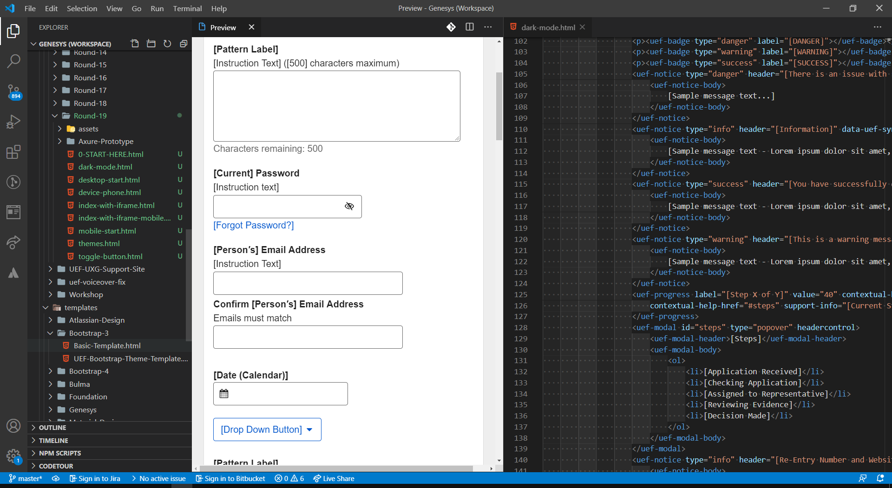

<h1 align="center">&#9885; Genesys</h1>
<h2 align="center">Design in the Browser Prototyping</h2>

Genesys provides a simple way to make rich, interactive prototypes using a declarative language (HTML). It enables designers and UI developers to quickly create low to high-fidelity prototypes, or even production-ready UI. 

Genesys provides support for most major design systems (Bootstrap, Material Design, Foundation, Ionic, Tailwind, Tachyons, et. al.) and you can add any others. 

Additional features include multi-lingual support, automated walk-throughs, on-screen comments, A/B testing, conditional logic, animation, and more--all through markup.

Requirements
------------

- [Microsoft Visual Studio Code](https://code.visualstudio.com/)
- [Genesys Extension](https://github.com/SSAgov/genesys-vscode-extension) for Visual Studio Code
- [Design in the Browser Extension](https://github.com/craigcecil/vscode-design-in-browser-pack) for Visual Studio Code
- Any modern browser

Live Demo
---------

- [Genesys Demo](https://ssagov.github.io/genesys/demo/genesys-demo.html)

Getting Started
---------------

1. Download the latest Genesys archive package from this repo.
2. Start Visual Studio Code and select **File** > **Open Folder...** and then select `Genesys` from the location you saved it to.
3. In VSCode, select the Extensions panel, search for and install the `Genesys` extension and the `Design in the Browser` extension from the Microsoft Extensions Marketplace.
4. Optional: Download and install [Git](https://git-scm.com/) in order to enable version control.

What is ‘Designing in the Browser’?
-----------------------------------

Designing in the Browser is a methodology that directly uses the browser as the design canvas. What does this mean? It means you will be using either the browser directly, or other pieces of software that interact directly with the browser to realize your design. The design lives directly in the language (HTML+CSS) and medium (browser) of the web.

Benefits
--------

- Requires minimal skills to get started--just HTML
- Creates accessible prototypes
- Once learned, much faster than any drag-and-drop tool
- Create dynamic designs that flex and change depending on the width of the screen
- Create designs that interact and behave exactly as deployed
- View desktop and mobile versions of a design at the same time
- Make design decisions based on actual browser behavior, rather than just assumptions in our designs. Think of it as deciding in the browser.
- Allows us to test early and get feedback on reality—not assumptions from abstracted tool output. As soon as a single piece of design is in the browser, it can be tested.
- Sets expectations early and allows the design to grow iteratively and organically.
- Code used in prototypes can serve as a basis for production ready code.
- Ultimately, it allows us to put content over form, embrace the fluidity of the web and the diaspora of devices, and focus on systems of design components instead of pages.

Features
--------

**Built-in Design Systems** 
Including Material Design, Bootstrap, Microsoft Fluent, U.S Web Design Standards, Salesforce Lightning, and more. Add your own as well.

**Accessibility Checking** 
Integrated accessibilty checking of your prototypes through ANDI and Lighthouse.

**Real-Time Collaboration** 
Integrated Kanban board, whiteboard and application sharing through LiveShare.

**Single Source of Truth** 
No more approximations of designs. Prototypes are 100% accurate and responsive, since they are built in the browser.

**Version Control** 
Explore and version designs with the integrated industry-standard Git version control system. View a visual history of design changes.

**Annotations & Walkthroughs** 
Easily add and view designer comments or fully automated design walkthroughs right in your prototypes.

**Roles, States and Conditional Logic** 
Multiple user roles, use cases, and conditional logic within a single prototype.

**Multi-Lingual** 
Switch between multiple language designs within the same prototype.

**Quick Mockups** 
Integrated drag & drop mockups with the embedded Draw.io application and prototyping stencils. (SVG Mode)

**Master Page Components** 
Define UI components once and reuse them on multiple pages as Master Page Components.

**Variables & Data Persistence** 
Easily pass user entered data from page to page.

**Charting & Diagramming** 
Create sustainable charts, diagrams, and user flows with integrated Mermaid support.

**Animation** 
Add animation to any element with predefined keywords.

**A/B Testing** 
Easily add simple A/B testing on page content, components, or entire page designs, right within a single prototype.

**UX Analytics** 
Built-in support for collecting UX-specific analytics via Google Analytics and the AutoTrack plugin

**Realistic Data** 
Rapidly create realistic, fake data specific in your designs with the integrated Faker extension.

**UX Measurements** 
Integrated support for industry standard SEQ, SUS, and TLX feedback.

The Genesys Toolbar
-------------------

The integrated Genesys toolbar contains the following functionality:

- Show/Hide Layout Grids
- Show/Hide Ruler
- Show/Hide Objects
- Show Object Properties/Styles
- Show/Hide Notes
- Grayscale Page
- Responsive Resize
- Edit Page
- Automated UI Tester
- Automated Accessibility Checker
- Responsive Web Design Tester

Design Systems Support
----------------------

Genesys provides built-in support for the following design systems and frameworks for building prototypes:

- [Atlassian Design](https://atlassian.design/)
- [Basscss](http://basscss.com/)
- [Bootstrap 3/4/5](http://getbootstrap.com/)
- [Bulma](http://bulma.io/)
- [Foundation](http://foundation.zurb.com/)
- [Ionic UI](https://ionicframework.com/docs/components)
- [Material Design](https://github.com/material-components/material-components-web)
- [Material Design Lite](https://getmdl.io/)
- [Materialize](http://materializecss.com/)
- [Microsoft Fabric](https://dev.office.com/fabric#/)
- [PaperCSS](https://www.getpapercss.com/)
- [Semantic UI](http://semantic-ui.com/)
- [Tachyons](http://tachyons.io/)
- [Tailwind](https://tailwindcss.com/)
- [Turret](http://turretcss.com/)
- [User Experience Framework](https://github.com/SSAgov/uef-vscode-extension)
- [UI Kit](https://getuikit.com/docs/introduction)
- [U.S. Web Design Standards](https://standards.usa.gov/)

Additionally, Genesys contains built-in support for [WebSlides](https://webslides.tv/#slide=1) and [Reveal.js](https://revealjs.com/) for creating web-based presentations.

Tutorials
---------

Genesys provides tutorials to lead you through all supported functionality, including walking you through your first design in the browser session.

You can find these tutorials in the <code>tutorials</code> folder.

