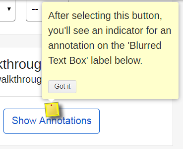
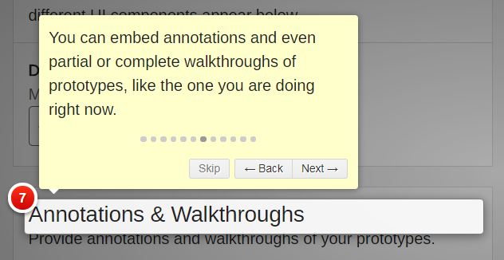

Adding Notes & Walkthroughs
========================================================================

This tutorial will show you how to add notes/annotations and walkthroughs to your prototype pages.

Adding Notes
------------

1. Add the Notes & Walkthroughs library to the page. Position your cursor in the `HEAD` section and type `gns-add-walkthru`. This will insert the code for both the Notes and Walkthrough functionality.

2. Anywhere on the page where you want to insert a note, type `data-hint="Your notes go here"`. For example, if you want to insert a note related to a particular input field, position your cursor just after the `input` element begins, type `data-hint=`, followed by your note in double-quotes:

     `<input data-hint="Here is something you really need to pay attention to." .... >`
     
Now, when you activate the Genesys Toolbar, selecting the Notes icon will display visual indicators for all of the Notes you have defined on the page. Selecting a Notes indicator will display your note.

Adding Walkthroughs
-------------------

It's often useful to include automated walkthroughs of your prototype pages. This will allow you to highlight and offer insights to remote project stakeholders and users.

Walkthroughs are composed of a series of steps that leads the viewer through the prototype.

1. Add the Notes & Walkthroughs library to the page. Position your cursor in the `HEAD` section and type `gns-add-walkthru`. This will insert the code for both the Notes and Walkthrough functionality.

1. Anywhere on the page where you want to insert a walkthrough step, type `data-step="1"`. Replace the `1` with the number of your walkthrough step. Steps must be consecutive, start from 1, and not be duplicated. 

1. Next, type `data-intro="Your walkthrough step text"`. For example, if you want to insert the 3rd step in your walkthrough that is related to an existing `DIV` section on your page, position your cursor just after the `DIV` element begins, type `data-step="3" data-intro="Pay particular attention to the content in this area"`.

Note that your walkthrough text you supply in the `data-intro` attribute can contain any type of HTML.
     
Now, when you activate the Genesys Toolbar, selecting the Walkthrough icon will start the automated walkthrough.

