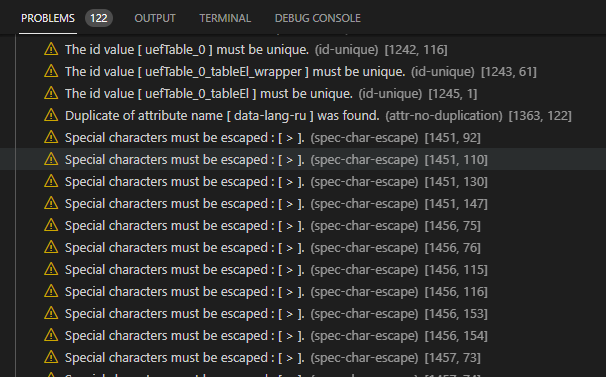

Design Tips when using VS Code
==============================

Visual Studio Code provides built-in assistance for creating HTML prototypes. This section presents tips for using this assistance.

Before using the tips presented below, make sure you've installed the `Design in the Browser Extension Pack` for Visual Studio Code. (You can search for it from the Extensions tab.)

Using the Problems tab to find and fix issues
---------------------------------------------

It can be very useful to select the `View` > `Problems` menu item. This will display the Problems panel, which tell's you exactly where you have issues in your HTML. Keep this panel open as you create your prototype page, and you'll be likely to spot issues as they occur.

In most cases, many of these issues can safely be ignored when creating a prototype. However, it does become useful for pointing out spelling errors, missing tags, accessibility problems, or other issues that may be causing problems with interactivity.

Other Indicators that Something is Wrong
----------------------------------------

If you notice that your prototype page does not appear as intended, look for any HTML code that is displayed in a red color.

Red coloration in the VS Code editor signifies that something is wrong with your HTML. Common issues include not including an ending quotation mark, not having a space between items, etc.

Add Unknown Words to Your VS Code Dictionary
--------------------------------------------

As you create prototype pages, especially those targeted at domain-specific use cases, you might notice that VS Code presents a squiggly underline for words that it does not recognize.

In these cases, if you confirm that your word is spelled correctly, right-click on that word and select the option to add it to your VS Code dictionary. This will remove the squiggly underline on the page and all other pages that contain it.
