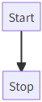
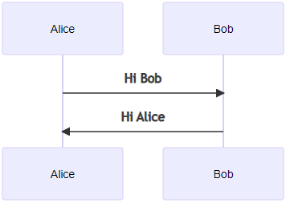
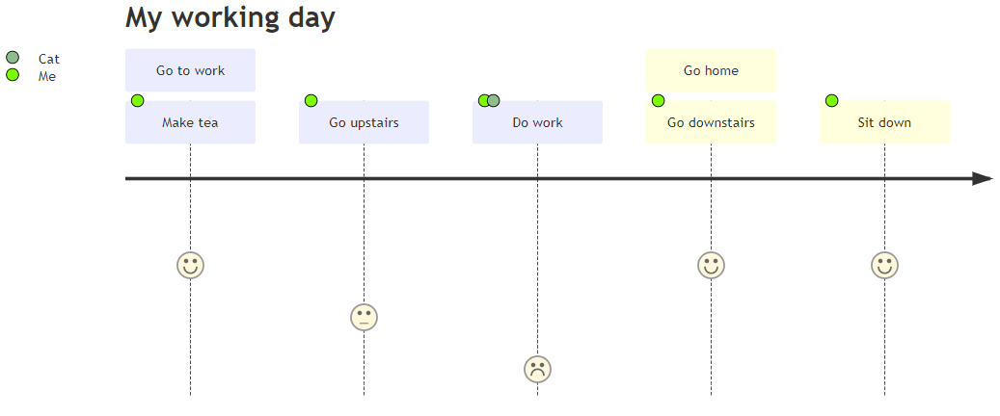

Creating Diagrams
=================

This tutorial will show you how to create flow diagrams to support your design efforts, using the Mermaid syntax.

Why would you want to do this, using this method?

Because your diagram drawing instructions are given in plain text, which never becomes obsolete, and those instructions can live alongside your content (just like on this page). Oh, and Mermaid is supported just about everywhere, is open-source, and will always be available.

Page Setup
----------

To include flowcharts and other types of diagrams in your project or prototype pages:

1. Use an existing HTML page or create a new one.
2. In the `HEAD`, type `gns-add-diagram-library`, which will load the Mermaid library into your page.
3. In the `BODY`, wherever you want to add a diagram, type `gns-insert-diagram`, which will add the following HTML:

````
<div class="mermaid">
    [INSERT YOUR DIAGRAM STATEMENTS]
</div>
````

Flowcharts
----------

To create a flowchart, use this type of diagram statement syntax:

````
graph TD
    Start --> Stop
````

This will automatically generate the following flowchart:



Sequence Diagrams
-----------------

To create sequence diagrams, follow this type of diagram statement syntax:

````
sequenceDiagram
    participant John
    participant Alice
    Alice->>Bob: Hi Bob
    Bob->>Alice: Hi Alice
````

This will automatically generate the following sequence diagram:



User Journeys
-------------

To create user journeys, follow this type of diagram statement syntax:

````
journey
    title My working day
    section Go to work
      Make tea: 5: Me
      Go upstairs: 3: Me
      Do work: 1: Me, Cat
    section Go home
      Go downstairs: 5: Me
      Sit down: 5: Me
````

This will automatically generate the following user journey diagram:



Other Types of Diagrams
-----------------------

You can also create other types of diagrams, including State diagrams and Gantt and Pie charts, and more. See the [Mermaid documentation](https://mermaid-js.github.io/mermaid/#/) for all diagram syntax and options.


Live Editing
------------

If you have installed the [Mermaid Diagram Previewer](https://marketplace.visualstudio.com/items?itemName=vstirbu.vscode-mermaid-preview) for Visual Studio Code, then you can see your diagrams being drawn as you type the diagram statement syntax.

You can also use the [Mermaid Live Editor](https://mermaidjs.github.io/mermaid-live-editor/#/edit/Z3JhcGggVEQKQVtDaHJpc3RtYXNdIC0tPnxHZXQgbW9uZXl8IEIoR28gc2hvcHBpbmcpCkIgLS0-IEN7TGV0IG1lIHRoaW5rfQpDIC0tPnxPbmV8IERbTGFwdG9wXQpDIC0tPnxUd298IEVbaVBob25lXQpDIC0tPnxUaHJlZXwgRltDYXJdCg) to assemble your diagrams and then paste the code into your web page.

Further References
------------------

- [Mermaid](https://mermaidjs.github.io/)
