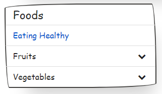

Create a Static Wireframe
=========================

This tutorial will show you how to create static wireframes using text, images, and other placeholders.

Step 1: Layout the Page
-----------------------

Use CSS Grids or your selected design system's grid system to create the basic page layout.

For our example, we'll refer to the article, <em><a href="https://ishadeed.com/article/grid-area/" target="_blank">CSS Grid Template Areas In Action</a></em>, and create the following page layout using CSS Grid:


To achieve this layout, we'll use the following HTML and CSS:

```html
<div class="wrapper">
  <header>Header</header>
  <aside>Sidebar</aside>
  <main>Main</main>
  <footer>Footer</footer>
</div>
```

```css
.wrapper {
    display: grid;
    grid-template-columns: 200px 1fr;
    grid-template-areas:
        "header header"
        "sidebar main"
        "footer footer";
  grid-gap: 1rem;
}

header {
  grid-area: header;
}

main {
  grid-column: main;
}

aside {
  grid-row: sidebar;
}

footer {
  grid-column: footer;
}
```

From here, you can start adding stubbed blocks, content, buttons, etc.

Step 2: Add Generic Stubs
-------------------------

Genesys includes several snippets for quickly inserting generic stubs, including blocks, buttons, headings, lorem ipsum, and images.

To see the complete list of Genesys Stubs, type `gns-stub` anywhere within the `BODY` of the page.

Add Sketch Effects (Optional)
-----------------------------

Use the sketch effects feature to make your pages look hand-drawn. Sometimes, this is useful to focus the conversation around the general content, layout, and flow of what you are designing, instead of diving into particulars regarding color, type, exact placement, etc.

You can add sketch effects to your web page by either manually adding the `gns-lofi` class to the `BODY` element, or by selecting the `Hi-Fi` button on the Genesys Toolbar to switch the page to `Lo-Fi`.

To add sketch effects manually:

1. In the `HEAD` of your page, type `gns-add-paper` to load the Paper sketch library.
2. In the `BODY` element, add the `gns-lofi` class. Note that you can just add this class to separate elements on your page if you only want to show a particular portion of the design in low-fidelity sketching, and not the entire page. This is very useful when iterating page designs, where some aspects of the page may become more developed than others.

 

Add Some Notes
--------------

You can add notes to anything on the page at any time. To see how to do this, check out the [Adding Notes & Walkthroughs](../01-Getting-Started/03-Adding-Notes-and-Walkthroughs.md) tutorial.
