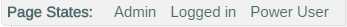

Add User Roles & States
=======================

This tutorial will show you how to incorporate user roles and states into your prototypes and dynamically change the UI, based on the current role or state.

Step 1: Define User Roles & States
----------------------------------

In the UX analysis of your project, you should identify, list, and name the various roles and states in the application which may alter the user interface.

For example, you might identify the following roles/states:

- A logged in user
- A logged out user
- An Administrator
- A Power User

From this information, name these roles/states, using an underscore to separate multiple words:

- Logged_in
- Admin
- Power_User

Step 2: Indicate UI based on Role/State
----------------------------------------------

After defining any names of roles/states you might need, indicate which parts of your user interface should appear or be hidden, depending on the role or state of the app.

You do this by prefacing your role/state name with `role_` as the class you assign to an HTML element.

For example, if we only want a logged in user to see the **Edit** button on the page, this is what we would add to the UEF Button snippet:

````
<button class="uef-btn uef-btn-secondary role_Logged_in" id="btnEdit">Edit</button>
````

Notice the addition of `role_Logged_in` to the `class` attribute above. That's all you need to do.

**Be careful: Role/State names are case-sensitive, so be consistent in your use.**

This same procedure works for any type of UI element, from content containers to buttons, links, menus, etc.

Step 3: Change Roles/States on your Prototype Interactively
-----------------------------------------------------------

When you have added your role/state class names to element(s) on the page, you will see a **Page States** section on the bottom right of the Genesys toolbar.



Select one of the Page States links to activate that role/state. Select it again, to deactivate.

Going Further: Combining Roles & States
---------------------------------------

Sometimes, you need to alter the UI based on several roles/states being active at the same time. To do this you can use the reserved class words `and`, `or`, and `not`.

For example, you might only want to show an **Approve** button when the user is logged in and is an administrator. We can accomplish this with the following:

````
<button class="uef-btn uef-btn-secondary role_Logged_In_and_Admin" id="btnEdit">Approve</button>
````

Notice that the class `role_Logged_in_and_Admin` was added to the `button` element.

Use underscores to separate your role/state names from the reserved `and`, `or`, and `not` words.
