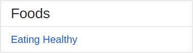
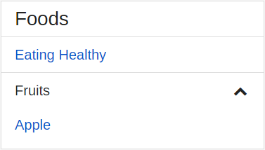
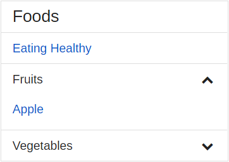

Adding UEF Sub-Navigation
=========================

This tutorial will show you how to insert a UEF Sub-Navigation component on your page. We will create a navigational list of fruits and vegetables.

Insert the Sub-Navigation Component
-----------------------------------

1. Place your cursor in the document where you want the Sub-Navigation component to appear.
2. Type <code>uef-subnav</code> and click the snippet to insert it. At this point, you won't see much of anything until you add a Sub-Navigation Title, a Group, or Links.

Customize the Sub-Navigation Component
--------------------------------------

1. Select <code>true</code> for <code>data-uef-nav-sub_nav-status_icons</code> if you want to use Status Icons within the Sub-Navigation component. For our example, we'll set it to false.
2. Select <code>true</code> for <code>data-uef-nav-sub_nav-hide_header</code> if you want to hide the Sub-Navigation Title. We don't want to hide the title in our example, so set this to false.
3. Enter your Sub-Navigation Title. Let's enter 'Foods' for our title.

At this point you will have a Sub-Navigation component with a Title. There will be no Sub-Navigation items at this point, so you'll need to add either Links or Groups.

Add Sub-Navigation Links
------------------------

1. Type <code>uef-subnav-add-link</code> to add a link item within your Sub-Navigation component.
2. Delete <code>uef-container-separator</code> if you don't want separator lines between link items. In our example, we'll keep it.
3. Select <code>available</code> or <code>unavailable</code> to set the display status of the link. In our example, select Available.
4. Replace the <code>#</code> with the name of an HTML file you are linking to&mdash; or, leave the <code>#</code> for now, if you don't have another page ready to link to at this time. For our example, just leave the # character for now.
5. Again, select <code>available</code> or <code>unavailable</code> to set the assistive display status of the link. For our example, select Available.
6. Finally, type the name of the Link. For our example, type 'Eating Healthy'.

Add Sub-Navigation Groups (Expanded)
------------------------------------

1. Type <code>uef-subnav-add-group</code> to add a group item within your Sub-Navigation component.
2. Delete <code>uef-container-shaded</code> if you don't want the group to be a shaded color. For our example, let's delete it.
3. Delete <code>uef-container-separator</code> if you don't want a separator line between groups. For our example, let's keep it.
4. Select <code>available</code> if this Group can be selected. Use <code>unavailable</code> to denote the Group is not selectable. For our example, we want to select Available.
5. Enter your Group's title. For our example, this group will be called 'Fruits'.
6. Enter your Group's name. This can be the same as the Group's title, but make sure there are no spaces in this name.
7. Finally, enter the display name for your first item within this group. Four our example, let's enter Apple.

Now, let's add a second group to make this a little more realistic. But this time, let's make the group appear collapsed when the page loads.

Add Sub-Navigation Groups (Collapsed)
------------------------------------

1. Type <code>uef-subnav-add-group-collapsed</code> to add a group item within your Sub-Navigation component.
2. Delete <code>uef-container-shaded</code> if you don't want the group to be a shaded color. For our example, let's delete it.
3. Delete <code>uef-container-separator</code> if you don't want a separator line between groups. For our example, let's keep it.
4. Select <code>available</code> if this Group can be selected. Use <code>unavailable</code> to denote the Group is not selectable. For our example, we want to select Available.
5. Enter your Group's title. For our example, this group will be called 'Fruits'.
6. Enter your Group's name. This can be the same as the Group's title, but make sure there are no spaces in this name.
7. Finally, enter the display name for your first item within this group. Four our example, let's enter Apple.

