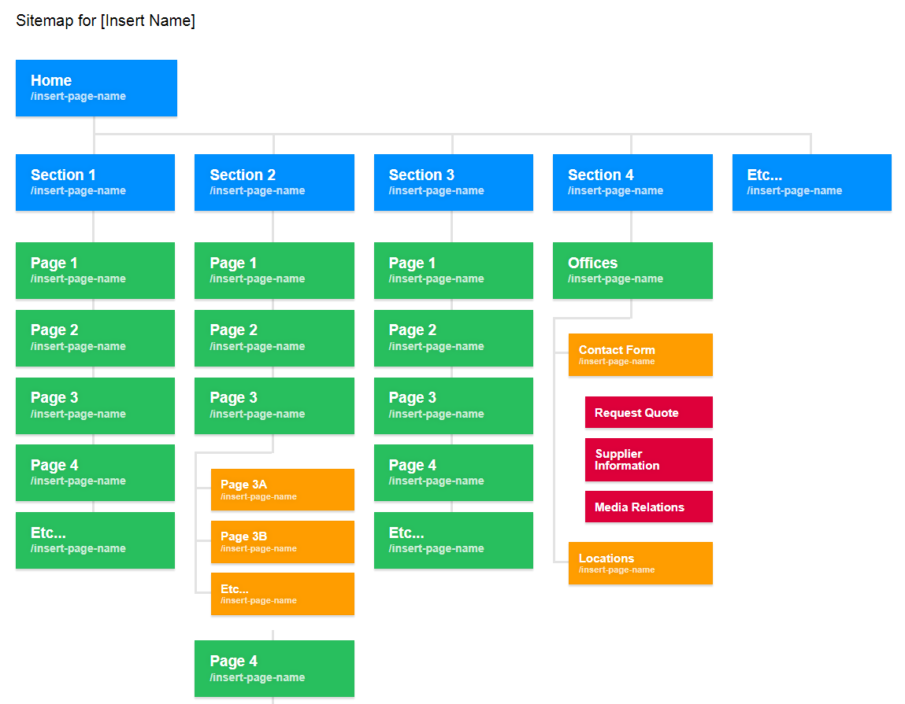

Creating a Site Map
===================

It's often useful to create a site map for your project, either as a standalone product or as a navigational aid to all of your prototype pages.

This tutorial will show you how to accomplish this.

The Site Map Template
---------------------

Ensure you have the `Genesys Extension` for VS Code installed.

Create a new HTML page, and type `!!sitemap`.

This is a complete starter Site Map that you can quickly modify to match your project's information architecture of pages.

If you can write normal HTML Lists (`UL`, `LI`), then you can make a sitemap.

Genesys Sitemap Snippets
------------------------

To quickly insert a new visual page indicator in your site map, type `gns-sitemap-add-page` to activate the Genesys Sitemap Add Page Snippet.

Enter a name for your page and it will be automatically appear and be visually linked within the site map.
