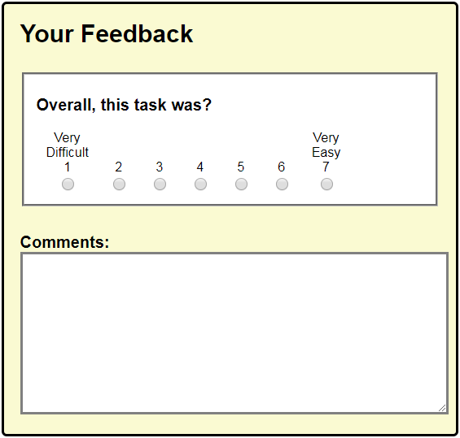
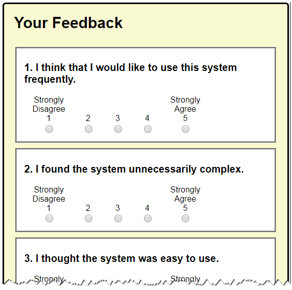
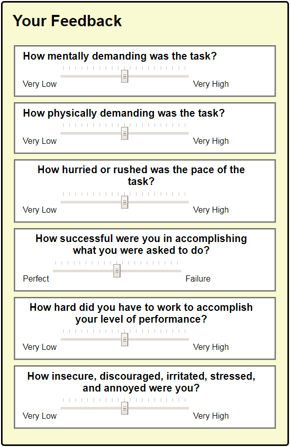

Measuring Perceived Usability
=============================

Genesys includes support for adding three types of self-reported quantitative data to your prototypes:

- Single Ease Question (SEQ)
- System Usability Scale (SUS)
- Task Load Index (TLX)

Adding a Single Ease Question (SEQ)
-----------------------------------

The Single Ease Question is a post-*task* questionnaire administered at the end of every task in a test session. It has been validated and demonstrated as reliable, valid, and sensitive.

- They allow you to compare which parts of your interface (or workflow) are perceived as most problematic, since the data is collected after *every* task.
- Since the task was just completed, it's fresh in the participant's mind, allowing a clear indication toward the experience, without subsequent tasks obscuring memory.

**To add a Single Ease Question to your prototype page:**

1. Ensure that you have loaded the Genesys Style Sheet on your prototype page. You can do this by typing <code>gns-stylesheet</code> in the HEAD section of your page.
2. Place your cursor where you want the SEQ added and type <code>gns-feedback-seq</code>.
3. Type in an identifier for your page at the highlighted cursor.

Adding a System Usability Scale (SUS)
-------------------------------------

The SUS is a post-test questionnaire, given to a participant after an entire usability testing session has completed. The SUS has a long history of validity and reliability.

**To add a System Usability Scale to your prototype:**

1. Add a new prototype page that will only contain the SUS.
2. Ensure that you have loaded the Genesys Style Sheet on your prototype page. You can do this by typing <code>gns-stylesheet</code> in the HEAD section of your page.
3. Place your cursor where you want the SEQ added and type <code>gns-feedback-sus</code>.

Adding a Task Load Index (TLX)
------------------------------

The NASA-TLX is another type of post-*task* questionnaire, applicable to complex or mission-critical products or tasks used by trained individuals. Since this is a complex questionnaire that should be answered after every key task, it will add time to the overall test process. Use this to evaluate systems where human errors are highly undesirable.

**To add a Task Load Index to your prototype:**

1. Add a new prototype page that will only contain the SUS.
2. Ensure that you have loaded the Genesys Style Sheet on your prototype page. You can do this by typing <code>gns-stylesheet</code> in the HEAD section of your page.
3. Place your cursor where you want the SEQ added and type <code>gns-feedback-tlx</code>.

Capturing Measured Usability Data
---------------------------------

To capture your user's perceived SEQ and SUS results for collation and analysis, refer to the section on [Recording User Test Sessions](Recording-User-Test-Sessions.md).

---------------------------------------------------

References
----------

- [Beyond the NPS: Measuring Perceived Usability with the SUS, NASA-TLX, and the Single Ease Question After Tasks and Usability Tests](https://www.nngroup.com/articles/measuring-perceived-usability/)